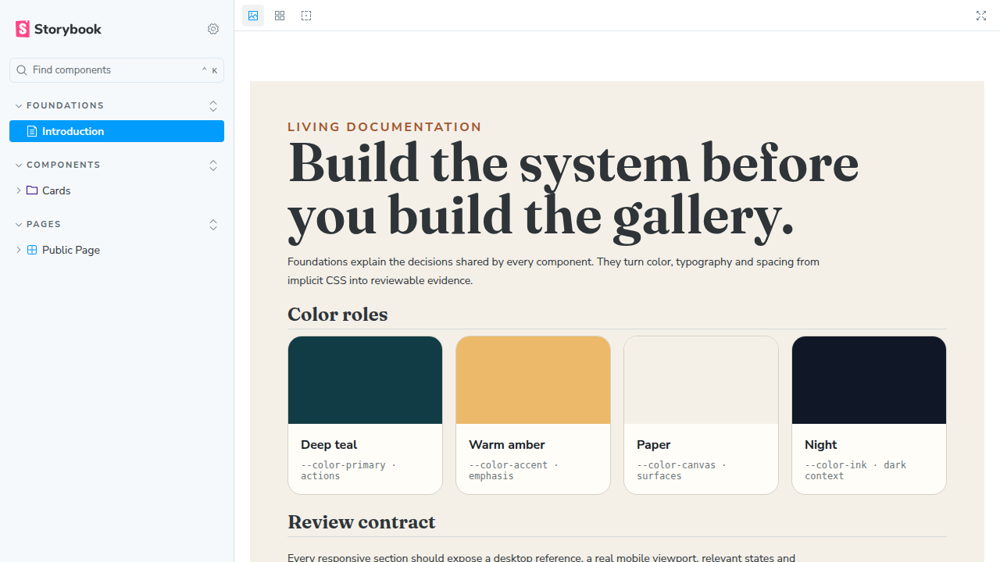
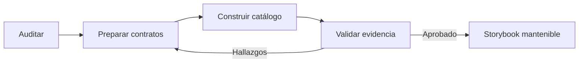
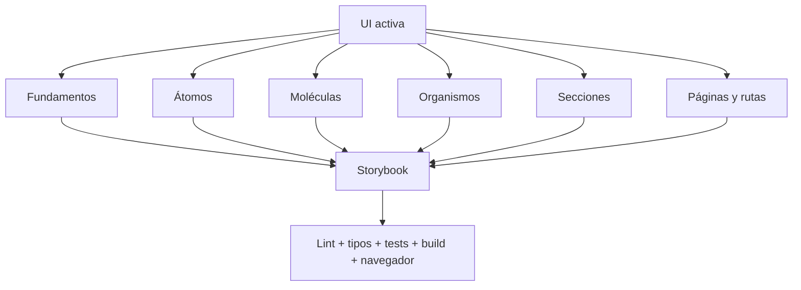
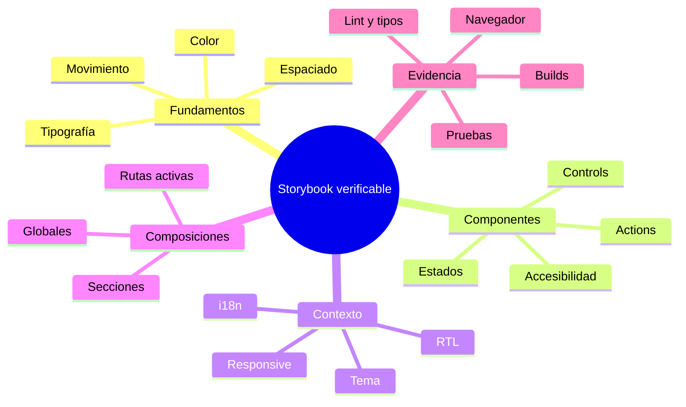
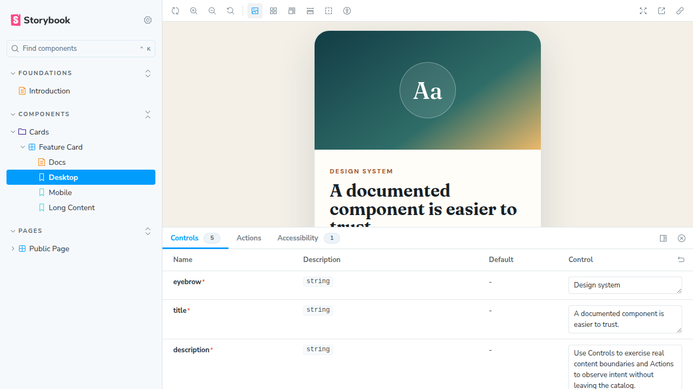
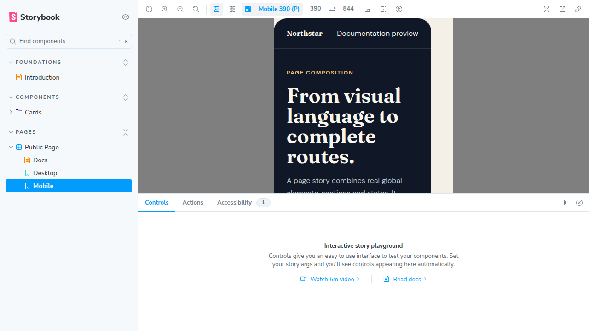
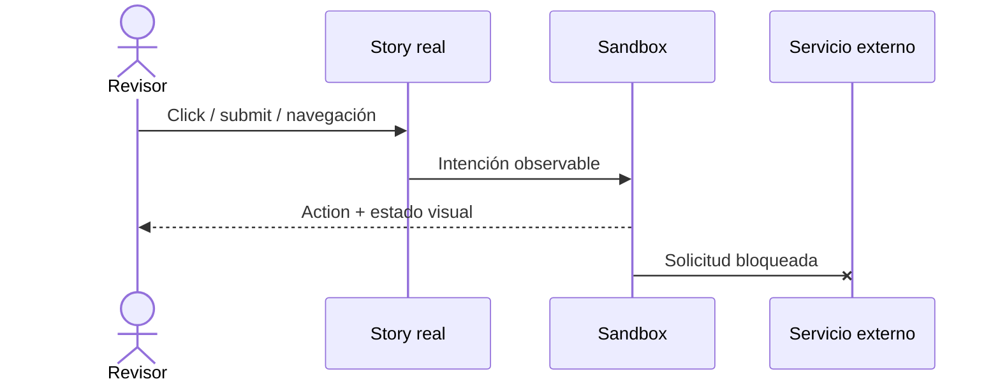

# OpenCode Storybook Agents

Suite reutilizable de agentes OpenCode para auditar, preparar, construir y validar
Storybook en proyectos React. El flujo prioriza evidencia, contratos productivos
mínimos, documentación viva, aislamiento de efectos y verificación independiente.

**[Abrir el playground publicado](https://adrianrafaelclaudio.github.io/opencode-storybook-agents/)**



## Qué incluye

| Archivo                               | Función                                           |
| ------------------------------------- | ------------------------------------------------- |
| `storybook-01-audit.md`               | Audita sin editar y produce la matriz inicial     |
| `storybook-02-ui-contracts.md`        | Implementa únicamente contratos UI justificados   |
| `storybook-03-builder.md`             | Construye Storybook, stories, MDX y aislamiento   |
| `storybook-04-standards-validator.md` | Valida sin editar y emite un veredicto            |
| `storybook-workflow.md`               | Comando que ejecuta las cuatro fases en orden     |
| `playground/`                         | Storybook neutral usado como ejemplo reproducible |
| `scripts/capture-evidence.mjs`        | Capturas de evidencia con Playwright              |

## Flujo



La separación impide que el mismo agente dé por válido un resultado que todavía no
ha intentado refutar. Auditoría y validación son de solo lectura.



Consulta [la arquitectura completa](docs/ARCHITECTURE.md) y la
[plantilla de cobertura](docs/COVERAGE-MATRIX.md).

## Requisitos

- [OpenCode](https://opencode.ai/) con soporte para agentes y comandos de proyecto.
- Un repositorio React. Vite es compatible, pero los agentes inspeccionan el stack
  antes de elegir builder o dependencias.
- Node y el gestor de paquetes que ya utilice el proyecto.
- Permiso para modificar la UI solo durante las fases 2 y 3.

Playwright no es requisito para instalar los agentes. Solo se usa para reproducir
las capturas de este repositorio o cuando el proyecto objetivo ya dispone de un
navegador automatizable.

## Instalación en cualquier proyecto

Desde la raíz del proyecto destino:

```bash
mkdir -p .opencode/agents .opencode/commands
curl -fsSL https://raw.githubusercontent.com/adrianrafaelclaudio/opencode-storybook-agents/main/.opencode/agents/storybook-01-audit.md -o .opencode/agents/storybook-01-audit.md
curl -fsSL https://raw.githubusercontent.com/adrianrafaelclaudio/opencode-storybook-agents/main/.opencode/agents/storybook-02-ui-contracts.md -o .opencode/agents/storybook-02-ui-contracts.md
curl -fsSL https://raw.githubusercontent.com/adrianrafaelclaudio/opencode-storybook-agents/main/.opencode/agents/storybook-03-builder.md -o .opencode/agents/storybook-03-builder.md
curl -fsSL https://raw.githubusercontent.com/adrianrafaelclaudio/opencode-storybook-agents/main/.opencode/agents/storybook-04-standards-validator.md -o .opencode/agents/storybook-04-standards-validator.md
curl -fsSL https://raw.githubusercontent.com/adrianrafaelclaudio/opencode-storybook-agents/main/.opencode/commands/storybook-workflow.md -o .opencode/commands/storybook-workflow.md
```

Reinicia OpenCode después de agregar agentes o comandos: la configuración se carga al
inicio de la sesión.

También puedes copiar el directorio desde un clon:

```bash
git clone https://github.com/adrianrafaelclaudio/opencode-storybook-agents.git /tmp/opencode-storybook-agents
mkdir -p .opencode/agents .opencode/commands
cp /tmp/opencode-storybook-agents/.opencode/agents/storybook-*.md .opencode/agents/
cp /tmp/opencode-storybook-agents/.opencode/commands/storybook-workflow.md .opencode/commands/
```

## Uso

Ejecuta el comando dentro del proyecto objetivo:

```text
/storybook-workflow Cubre las rutas públicas, tema claro/oscuro, móvil, español e inglés.
```

Para controlar cada aprobación, invoca los agentes en secuencia y conserva el handoff:

```text
@storybook-01-audit Audita Storybook y entrega una matriz sin editar archivos.
@storybook-02-ui-contracts Implementa los contratos mínimos del handoff aprobado.
@storybook-03-builder Completa Storybook con la auditoría y los contratos anteriores.
@storybook-04-standards-validator Valida el resultado sin editar y emite un veredicto.
```

### Ejemplos de solicitudes

```text
/storybook-workflow Documenta el dashboard y sus estados loading, vacío y error. No agregues red real.
```

```text
@storybook-01-audit Revisa únicamente el checkout. Incluye teclado, móvil y errores de pago.
```

```text
@storybook-03-builder Usa los contratos aprobados. Crea fundamentos MDX, stories de las rutas activas y pruebas play deterministas.
```

## Qué produce



El resultado esperado no es “tener muchas stories”. Es una matriz donde cada pieza
activa tiene propósito, estados, contexto y evidencia proporcionales a su riesgo.

## Evidencia visual del playground

El playground demuestra la estructura que los agentes buscan, sin imponer su paleta
o componentes a otros proyectos.

### Fundamentos y tokens


### Componente con Controls y Autodocs



### Página en viewport móvil



Las capturas se generan con Playwright a partir de código incluido en el repositorio.
Consulta [PLAYWRIGHT-EVIDENCE.md](docs/PLAYWRIGHT-EVIDENCE.md) para reproducirlas.

## Adaptación al proyecto

Los agentes leen instrucciones locales antes de actuar. Para obtener mejores resultados,
documenta en `AGENTS.md`, `CLAUDE.md` o el archivo que utilice tu equipo:

- comandos de lint, typecheck, pruebas y build;
- framework, versión de React y gestor de paquetes;
- temas, idiomas, rutas activas y convenciones de CSS;
- política de red, mocks y datos sensibles;
- reglas de CI, commits y publicación;
- fuentes canónicas de tokens y contenido.

No copies el playground a producción. Sus componentes son ejemplos visuales; el flujo
debe documentar los componentes reales del proyecto destino.

## Seguridad y determinismo



- No enviar formularios ni analytics reales.
- No abrir WhatsApp, pagos o redes sociales durante pruebas.
- No persistir preferencias de demostración en el almacenamiento productivo.
- Fijar fechas, año, timers y autoplay cuando afecten la reproducción.
- Restaurar URL, scroll, tema, idioma y globals al desmontar.
- Marcar fixtures y contenido de demostración para no confundirlos con producto.

## Verificación sugerida

Los nombres exactos dependen del proyecto, pero el gate debe cubrir:

```bash
npm run lint
npm run typecheck
npm run test
npm run build
npm run build-storybook
```

No añadas un script inexistente únicamente para satisfacer esta lista: la auditoría
debe descubrir primero los comandos reales. Si el proyecto no tiene typecheck o pruebas,
el validador debe declararlo como brecha, no ocultarlo.

## Playground local

```bash
npm install
npm run storybook
```

Abre <http://localhost:6006>.

Para generar el catálogo y las capturas:

```bash
npm run build-storybook
npm run evidence
```

## Contribuir

1. Mantén los agentes genéricos y basados en evidencia.
2. No agregues nombres, rutas, credenciales ni reglas privadas de un proyecto cliente.
3. Actualiza el playground si una instrucción nueva necesita evidencia visual.
4. Ejecuta el build y reproduce las capturas antes de abrir un pull request.

## Licencia

[MIT](LICENSE)
