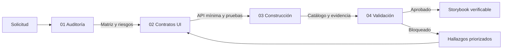
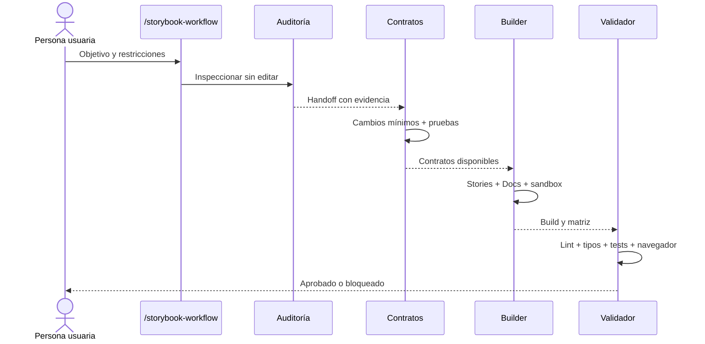

# Arquitectura del flujo

La suite divide una tarea grande en cuatro responsabilidades comprobables. Cada fase
recibe la evidencia de la anterior y entrega un handoff explícito.

## Responsabilidades

| Fase         | Puede editar | Responsabilidad                                       | Entrega                          |
| ------------ | ------------ | ----------------------------------------------------- | -------------------------------- |
| Auditoría    | No           | Descubrir stack, UI activa, rutas, contexto y riesgos | Matriz y plan priorizado         |
| Contratos UI | Sí           | Abrir APIs mínimas sin cambiar defaults productivos   | Props tipadas, pruebas y handoff |
| Construcción | Sí           | Configurar Storybook, historias, MDX y aislamiento    | Catálogo estático y resultados   |
| Validación   | No           | Intentar demostrar que el resultado cumple            | Matriz final y veredicto         |

## Principios de diseño

1. **Evidence first:** no se inventan categorías, tokens, rutas ni estados.
2. **Producción por defecto:** toda prop documental opcional preserva el comportamiento original.
3. **Aislamiento observable:** una acción externa se registra, no se ejecuta silenciosamente.
4. **Componentes reales:** wrappers solo preparan contexto; no reemplazan el JSX del producto.
5. **Responsive real:** los viewports cambian el iframe, no el ancho de un contenedor decorativo.
6. **Validación independiente:** la fase final no corrige su propia evidencia.
