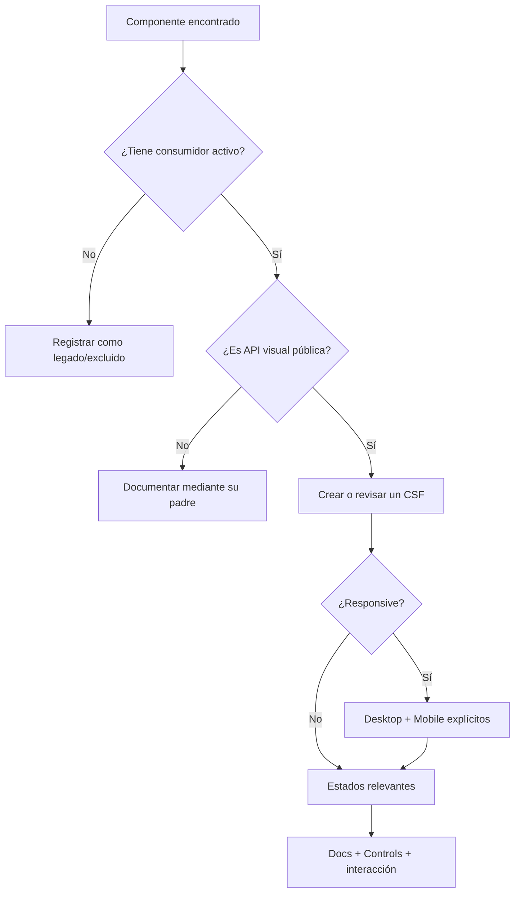

# Plantilla de matriz de cobertura

La auditoría y la validación deben usar una matriz verificable, no un porcentaje sin
definición. Duplica esta tabla dentro del proyecto objetivo y reemplaza los ejemplos.

| Módulo            | Uso real    | Story                     | Desktop | Mobile | Tema | Idioma/RTL    | Estados     | Play     | Docs       | Resultado |
| ----------------- | ----------- | ------------------------- | ------- | ------ | ---- | ------------- | ----------- | -------- | ---------- | --------- |
| Acción primaria   | Activo      | `Action.stories.tsx`      | N/A     | N/A    | Sí   | Copy largo    | Disabled    | Click    | Autodocs   | Cubierto  |
| Tarjeta editorial | Activo      | `ContentCard.stories.tsx` | Sí      | Sí     | Sí   | RTL           | Vacío/largo | Callback | Autodocs   | Parcial   |
| Navegación global | Activo      | `Header.stories.tsx`      | Sí      | Sí     | Sí   | Selector/RTL  | Scroll/menú | Teclado  | Autodocs   | Cubierto  |
| Página de ejemplo | Ruta activa | `Page.stories.tsx`        | Sí      | Sí     | Sí   | Idiomas clave | Datos/error | Flujo    | Autodocs   | Cubierto  |
| Widget anterior   | Legado      | Ninguna                   | N/A     | N/A    | N/A  | N/A           | N/A         | N/A      | Inventario | Excluido  |

## Estados permitidos

- **Cubierto:** evidencia ejecutable y documentación suficiente.
- **Parcial:** existe story, pero falta contexto, variante o comprobación.
- **Falta:** la UI activa no tiene documentación ejecutable.
- **Excluido:** legado o módulo sin consumidor, con razón registrada.
- **No aplica:** la dimensión no pertenece al contrato.

