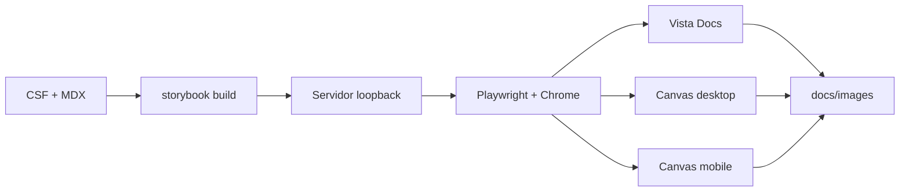

# Evidencia con Playwright

El playground incluye un Storybook neutral y un script Playwright que produce las
capturas publicadas en `docs/images/`.

## Reproducir

```bash
npm install
npm run build-storybook
npm run evidence
```

El script levanta `storybook-static/` únicamente en `127.0.0.1`, abre Storybook con
Playwright, espera a que Docs o Canvas terminen de renderizar y toma capturas. Por
defecto usa el Chrome instalado en `/usr/bin/google-chrome`; puede cambiarse así:

```bash
CHROME_BIN=/ruta/al/chrome npm run evidence
```



Las capturas son evidencia visual general, no snapshots de regresión. Un pipeline
real debería añadir pruebas de interacción, axe y la estrategia visual elegida por
el equipo.
